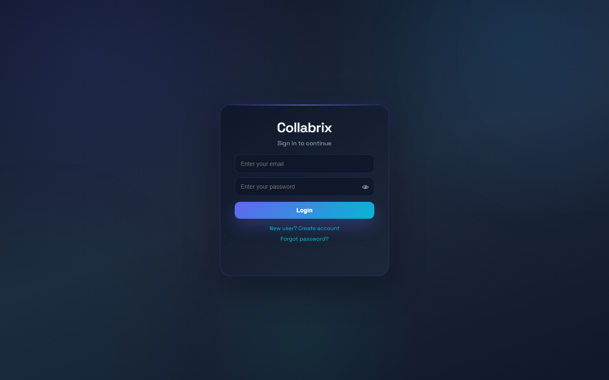
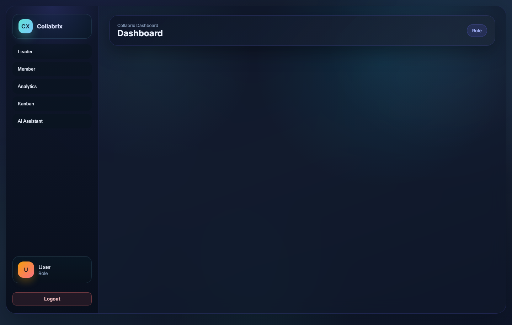
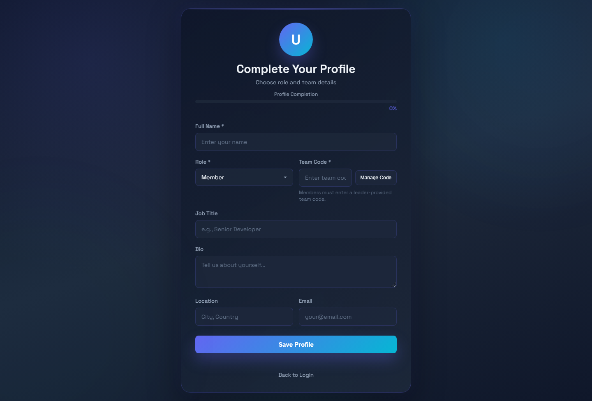
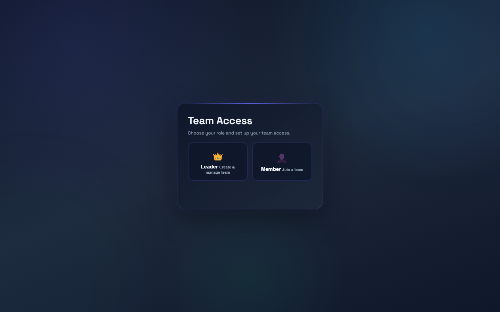

# Collabrix - Task Management App

Modern realtime task management with Kanban boards, analytics, AI assistant, and Supabase sync.

## Features
- ✅ Realtime task sync
- 📊 Analytics dashboard with pie charts & progress bars
- 🏗️ Drag-drop Kanban boards
- 🤖 AI task assistant
- ⏰ Deadline reminders & countdowns
- 👥 Leader/Member roles & team chat
- 🎨 Responsive dark theme

## Screenshots
**Landing / Overview**
Top-level overview and entry points for tasks and teams.

**Dashboard**
KPIs and progress widgets for the current workspace.

**Kanban Board**
Drag-and-drop workflow columns for tasks.

**Analytics**
Charts and completion metrics for performance.

**Profile**
User details and personal settings.

**Team Access**
Role and membership management for teams.

**Team Code**
Join code and team invite management.

**AI Assistant**
Full-screen AI workspace with team-wide chat and history.

## Quick Start
1. Open `index.html` in browser
2. Signup → Set role & team code
3. Create/manage tasks

## Supabase Setup
Run `supabase-policies.sql` & `fix-tasks-table.sql` in SQL Editor.

## AI Setup
Set `GROQ_API_KEY` in your environment (local `.env` or hosting platform) to enable the AI assistant.

## Deploy
- Frontend: Static hosting (Netlify/Vercel)
- Backend: Node.js API (`backend/server.js`)

Live demo: https://collabrix-lyart.vercel.app
